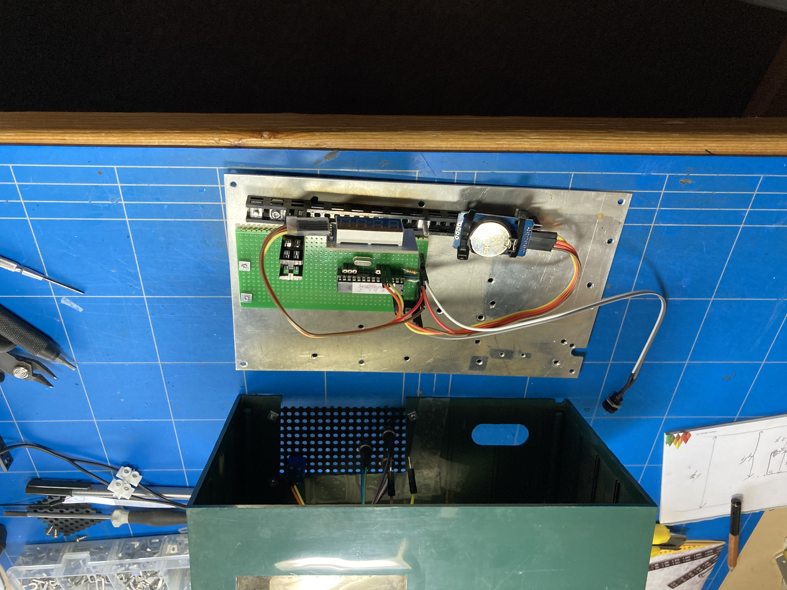
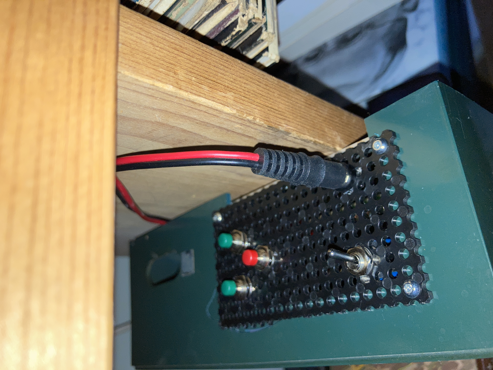
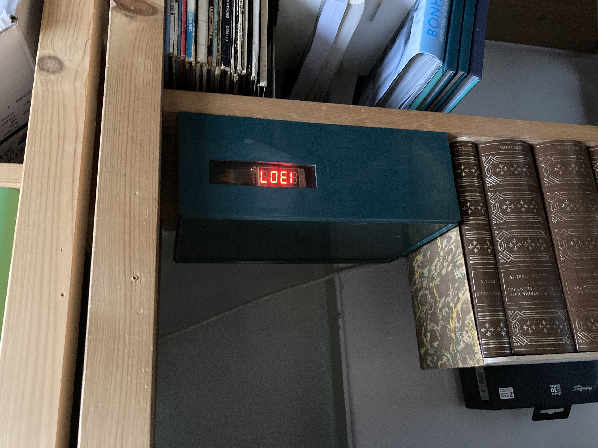

# gawclock

This is my take at a digital clock, centered around an ATMEGA328P chip.
Time is being kept by a DS3231 RTC module. 
It hosts a CR2032 battery, keeping the time when a power outage occurs.
The display is a TM1637 module.
Both with their respective libraries (credits in the code).

## Operating

#### Date - Time
One switch (SPDT) is used to switch the display between time and date.

#### Settings
Three push buttons are used for settings:
- one for starting the setting sequence
- two for moving the values up and down respectively

There are seven numbered settings. 
The setting number is indicated in the first digit:
1. set the year value (00-99)
2. set the month value (01-12)
3. set the date value (01-31) <<== beware of proper value with respect to month value
4. set the hour value (00-23)
5. set the minute value (00-59)
6. set the second value (00-59)
7. set the brightness value (1-7)

## Images

### Construction

### Switches and buttons

#### Completed

